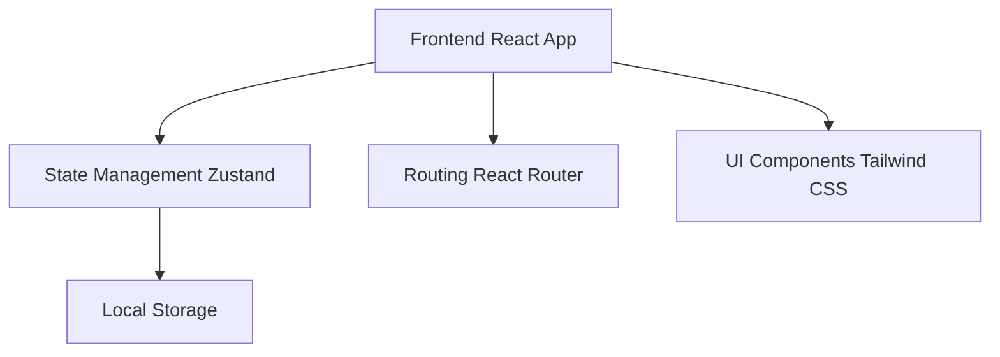

## 1. Architecture Design


## 2. Technology Description
- Frontend: React@18 + TypeScript + tailwindcss@3 + vite
- Initialization Tool: vite-init
- Backend: None (纯前端应用，数据存储在本地)
- Database: LocalStorage
- State Management: zustand

## 3. Route Definitions
| Route | Purpose |
|-------|---------|
| / | 学习页面 - 主要的单词学习界面 |
| /review | 复习页面 - 复习需要巩固的单词 |
| /vocabulary | 词库页面 - 浏览所有单词列表 |
| /stats | 统计页面 - 学习进度统计 |

## 4. Data Model

### 4.1 Word Type Definition
```typescript
interface Word {
  id: string;
  word: string;
  phonetic: string;
  meaning: string;
  example: string;
  exampleTranslation: string;
  difficulty: 'easy' | 'medium' | 'hard';
  status: 'new' | 'learning' | 'mastered';
  reviewCount: number;
  nextReview: Date | null;
  createdAt: Date;
}
```

### 4.2 Stats Type Definition
```typescript
interface Stats {
  totalWords: number;
  learnedWords: number;
  masteredWords: number;
  streak: number;
  lastStudyDate: Date | null;
  dailyStudy: Record&lt;string, number&gt;;
}
```

### 4.3 Store State Definition
```typescript
interface WordStore {
  words: Word[];
  currentWordIndex: number;
  stats: Stats;
  addWord: (word: Omit&lt;Word, 'id' | 'createdAt'&gt;) =&gt; void;
  updateWordStatus: (id: string, status: Word['status']) =&gt; void;
  nextWord: () =&gt; void;
  prevWord: () =&gt; void;
  getReviewWords: () =&gt; Word[];
  saveToLocalStorage: () =&gt; void;
  loadFromLocalStorage: () =&gt; void;
}
```
