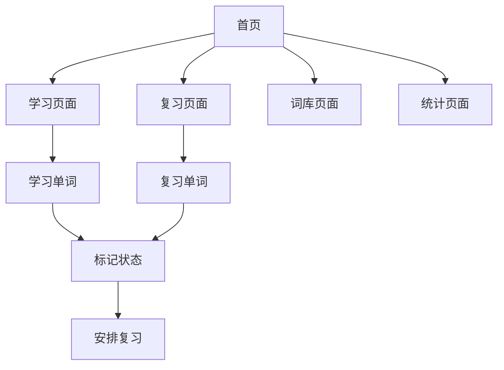

## 1. Product Overview
一个帮助用户高效学习四级英语单词的背单词小程序，提供卡片式学习、复习进度跟踪和单词测试功能。
- 主要服务于备考四级英语的用户，解决单词记忆效率低、复习无规划的问题
- 通过科学的记忆方法和友好的界面设计，提升用户背单词的体验和效率

## 2. Core Features

### 2.2 Feature Module
1. **学习页面**: 单词卡片展示、发音、释义、例句、标记掌握状态
2. **复习页面**: 根据记忆曲线展示需要复习的单词
3. **词库页面**: 浏览所有单词列表，按难度分类
4. **统计页面**: 学习进度统计、掌握情况图表展示

### 2.3 Page Details
| Page Name | Module Name | Feature description |
|-----------|-------------|---------------------|
| 学习页面 | 单词卡片 | 左右滑动切换单词，点击卡片显示/隐藏释义，发音按钮 |
| 学习页面 | 进度条 | 显示当前学习进度，已学/未学单词数量 |
| 复习页面 | 复习卡片 | 显示需要复习的单词，提供记住/忘记按钮 |
| 词库页面 | 单词列表 | 展示所有单词，支持搜索和筛选，显示掌握状态 |
| 统计页面 | 进度图表 | 展示学习进度、掌握率、每日学习量等数据 |

## 3. Core Process
用户打开应用后，首先进入学习页面，开始背单词。可以选择新单词学习或复习已学单词。学习过程中可以标记单词掌握状态，应用会根据记忆曲线安排复习时间。用户可以随时查看词库和学习统计。

## 4. User Interface Design
### 4.1 Design Style
- 主色调：深蓝色 (#1e3a8a) 搭配浅蓝色 (#3b82f6) 作为辅助色
- 按钮风格：圆角矩形，带有轻微阴影，悬停时有缩放动画
- 字体：使用 Inter 字体家族，标题使用加粗，正文使用常规字重
- 布局风格：卡片式布局，顶部导航栏，底部标签栏
- 图标风格：简约线性图标，来自 lucide-react

### 4.2 Page Design Overview
| Page Name | Module Name | UI Elements |
|-----------|-------------|-------------|
| 学习页面 | 单词卡片 | 白色背景，圆角卡片，阴影效果，左右滑动动画 |
| 学习页面 | 进度条 | 渐变蓝色进度条，百分比显示 |
| 词库页面 | 单词列表 | 表格形式，交替行颜色，掌握状态标签 |
| 统计页面 | 图表 | 简洁的柱状图和圆形进度图 |

### 4.3 Responsiveness
- 采用响应式设计，适配桌面端和移动端
- 移动端优化触摸交互，增大按钮可点击区域
- 自适应布局，在不同屏幕尺寸下保持良好体验
